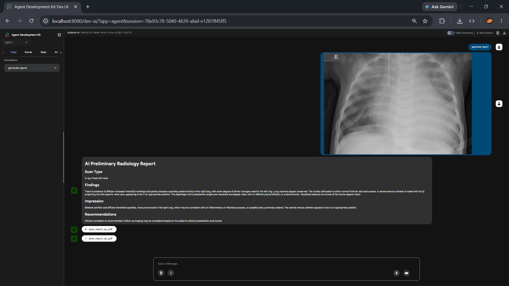
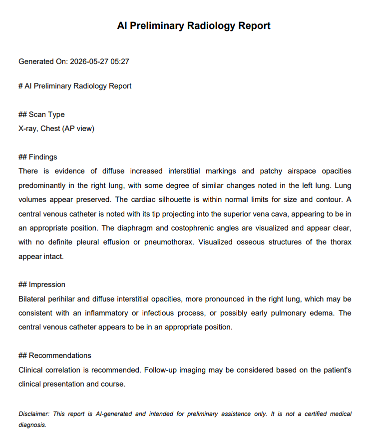

# Building an AI-Assisted Radiology Report Generator with Google ADK and Gemini

## Meet the Builder

Medical imaging plays a critical role in modern healthcare. Every day, radiologists analyze X-rays, CT scans, MRI scans, and other diagnostic images to identify abnormalities and support clinical decision-making. While advances in imaging technology have improved diagnostic capabilities, report generation remains a time-consuming process that requires careful documentation and interpretation.

As part of my exploration of healthcare AI, I built an **AI-Assisted Radiology Report Generator** using **Google Agent Development Kit (ADK)** and **Gemini 2.5 Flash**. The goal was to investigate how multimodal AI could help transform medical images into structured preliminary radiology reports while keeping healthcare professionals in control of the final diagnosis.

---

## The Challenge

Radiology workflows often involve two major tasks:

1. Interpreting medical images.
2. Documenting findings in a structured report.

Even after identifying important observations within an image, healthcare professionals must spend additional time creating clear and organized reports.

This challenge becomes more significant in healthcare systems experiencing:

* Growing imaging volumes
* Increased reporting workloads
* Limited specialist availability
* Longer report turnaround times

I wanted to explore whether modern multimodal AI could help streamline this process.

---

## The Idea

The concept behind this project was simple:

> Upload a medical image, allow AI to analyze it, generate structured findings and impressions, and automatically produce a downloadable report.

Rather than replacing radiologists, the system acts as an assistant capable of drafting preliminary reports that can be reviewed and refined by healthcare professionals.

The result is a workflow that transforms a medical image into a structured report within seconds.

---

## Why Google AI?

This project was built using Google's AI ecosystem because of its powerful multimodal capabilities and developer tools.

### Gemini 2.5 Flash

Gemini 2.5 Flash serves as the intelligence engine behind the application.

It is responsible for:

* Understanding uploaded medical images
* Extracting relevant observations
* Generating radiology findings
* Producing clinical impressions
* Creating structured report content

Because Gemini can process both visual and textual information, it is particularly well suited for healthcare documentation workflows.

### Google Agent Development Kit (ADK)

Google ADK orchestrates the entire workflow.

The agent coordinates:

* Image handling
* Prompt execution
* AI analysis
* Structured output generation
* Report creation

This allows multiple tasks to be managed through a single AI-powered pipeline.

---

## System Workflow

The workflow follows a simple architecture:

```text
Medical Image Upload
          ↓
    Gemini 2.5 Flash
          ↓
      ADK Agent
          ↓
 Structured Findings
          ↓
  Report Generation
          ↓
      PDF Export
```

The combination of Gemini and ADK enables a complete end-to-end reporting workflow.

---

## Application Walkthrough

### Step 1: Upload a Medical Image

The user uploads a medical image through the application.

The image is sent to Gemini for multimodal analysis, where relevant observations are extracted and transformed into structured medical findings.



*Figure 1: Google ADK web interface displaying AI-generated radiology findings and impressions.*

---

### Step 2: Generate a Structured Radiology Report

Once image analysis is complete, the agent produces a structured report containing:

* Findings
* Observations
* Clinical impressions

The generated content is organized into a format commonly used in radiology documentation workflows.

---

### Step 3: Export as PDF

The generated report can then be exported as a PDF document for documentation and review.



*Figure 2: Automatically generated PDF report created from AI-produced findings and impressions.*

---

## Features

The prototype currently supports:

* Medical image upload
* Multimodal image analysis
* AI-generated radiology findings
* Structured impressions and observations
* PDF report generation
* Workflow orchestration through Google ADK

These features demonstrate how multimodal AI can assist with healthcare documentation tasks.

---

## What I Learned

Building this project reinforced several important lessons about healthcare AI.

### Human Oversight Is Essential

Healthcare is a high-stakes domain.

AI-generated reports should always be reviewed and validated by qualified medical professionals before any clinical use.

### Multimodal Models Unlock New Possibilities

The ability to combine image understanding with natural language generation makes it possible to automate workflows that traditionally required significant manual effort.

### Structured Outputs Matter

Generating well-organized findings and impressions produces more useful results than generating unstructured text.

---

## Potential Impact

Although this project is an educational prototype, it highlights how AI can support healthcare professionals by:

* Reducing documentation burden
* Accelerating preliminary report creation
* Improving workflow efficiency
* Supporting healthcare environments with limited resources

The objective is not to replace radiologists but to augment their capabilities and allow more time to be spent on patient care and clinical decision-making.

---

## Tech Stack

* Google Agent Development Kit (ADK)
* Gemini 2.5 Flash
* Python
* FPDF

---

## Future Improvements

Future versions could include:

* Support for multiple imaging modalities
* Enhanced report validation workflows
* Integration with healthcare information systems
* Retrieval-augmented medical knowledge support
* Continuous improvement through clinician feedback

---

## Disclaimer

This project is an AI-assisted healthcare prototype created for educational and research purposes only.

It is not intended for clinical deployment, certified diagnosis, or medical decision-making. All generated reports should be reviewed and validated by qualified healthcare professionals.

---

## Conclusion

This project demonstrates how Google AI technologies can be applied to real-world healthcare challenges through multimodal intelligence and workflow automation.

By combining Gemini 2.5 Flash with Google Agent Development Kit, the AI-Assisted Radiology Report Generator showcases how medical images can be transformed into structured reports that support healthcare professionals and streamline documentation workflows.

As multimodal AI continues to evolve, tools like these may become valuable assistants that help healthcare systems improve efficiency while keeping human expertise at the center of every decision.
